# HTTP Traffic Monitor

**A free, open-source HTTP/HTTPS debugging proxy for Windows with a built-in MCP server — so Claude and other AI assistants can inspect, filter, replay and mock the traffic you capture.**

For developers and testers on Windows who need to see what an app, a service or a browser really sends and receives: a Fiddler/Charles-style traffic inspector, MIT-licensed, that your AI assistant can drive too.

[**⬇ Download for Windows**](https://github.com/Makhsum/httptrafficmonitr/releases/latest) · [**▶ Watch the demo**](#see-it-in-action) · [How it compares](#how-it-compares) · [MCP setup](#configuring-the-mcp-server)

**Why pick it**
- **AI-ready out of the box** — 42 MCP tools let an assistant start a capture, find the failing requests, replay them and set up mocks; no paid tier.
- **Every app on the machine, not one browser tab** — it captures system-wide as the Windows proxy and shows which process sent each request.
- **Free and open source** — MIT license, Fluent UI with light and dark themes.

**From download to the first captured request**
1. Download the app zip from [Releases](https://github.com/Makhsum/httptrafficmonitr/releases/latest) and unzip it (or [build from source](#build--run)).
2. Run `HttpTrafficMonitor.exe`, accept the administrator prompt and read the security notice.
3. Click **Start** — the app installs its local root CA (confirm if Windows asks) and becomes the system proxy.
4. Open any website or call an API: the requests appear in the grid. Click one to see its headers, body, timing and certificate.

## See it in action

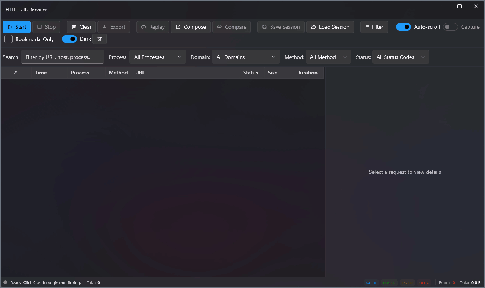

## How it compares

| | HTTP Traffic Monitor | Fiddler Everywhere | Charles | mitmproxy | Browser DevTools |
|---|---|---|---|---|---|
| Price | Free, open source (MIT) | Paid subscription | Paid license | Free, open source | Free, part of the browser |
| Platforms | Windows 10/11 | Windows, macOS, Linux | Windows, macOS, Linux | Windows, macOS, Linux | Wherever the browser runs |
| Captures traffic of other apps, not just the browser | Yes, system-wide, with the process name | Yes | Yes | Yes | No — only the page it is attached to |
| Interface | Desktop app | Desktop app | Desktop app | Terminal and web UI | Panel in the browser |
| MCP server for AI assistants | Built in, free | Built in, Pro tier and up | Not built in | Not built in | Not built in |

Choose this tool when you are on Windows and want a free graphical inspector that an AI assistant can work with. If you need macOS or Linux, or to script the proxy itself, mitmproxy, Charles or Fiddler Everywhere fit better. *(Details of the other tools as of October 2026 — corrections welcome.)*

## What it does

`HttpTrafficMonitor` sits between your machine and the internet as a local proxy (via [Titanium.Web.Proxy](https://github.com/justcoding121/Titanium-Web-Proxy)), decrypts HTTPS on the fly with a locally-generated root CA, and shows every request/response as it happens — searchable, filterable, and exportable.

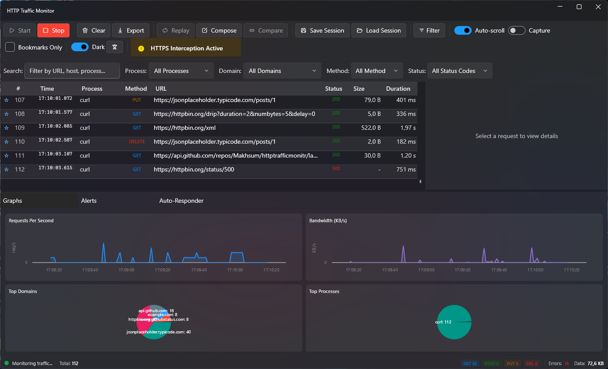

*The screenshots show demo traffic only: `curl` calls to public sample APIs (JSONPlaceholder, httpbin, example.com, GitHub). The 404 and 500 responses among them are requested on purpose, to show how failed requests stand out.*

## Features

### Capture & inspect
- Start/Stop system-wide HTTP/HTTPS capture with one click (installs a root CA for TLS interception, restored automatically on Stop)
- Live request grid: method, URL, status, size, duration, colored badges, and a red highlight for slow requests
- Quick search plus dedicated Process / Domain / Method / Status filters
- Per-request detail tabs: **Request**, **Response**, **Timing** (DNS/TCP/TLS/TTFB/download breakdown), **Certificate** (chain, issuer, validity, thumbprint), **Decoded** (gzip/brotli/base64 aware), and **Exclusions**

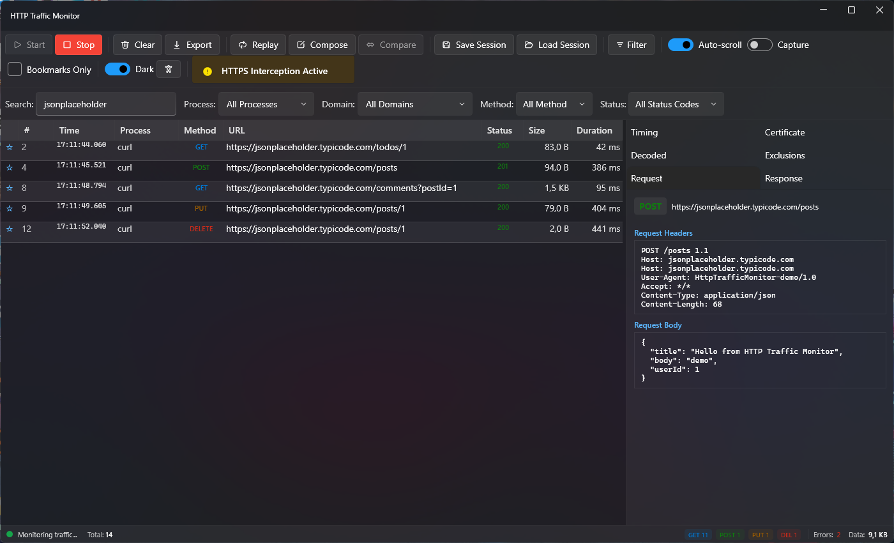
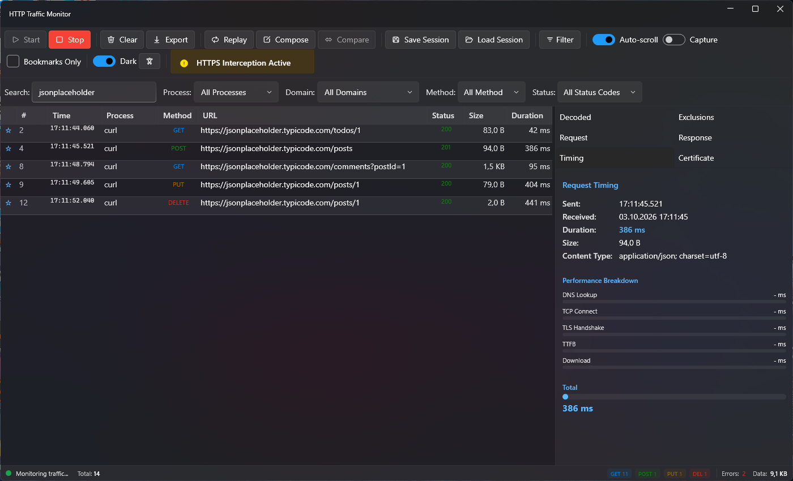
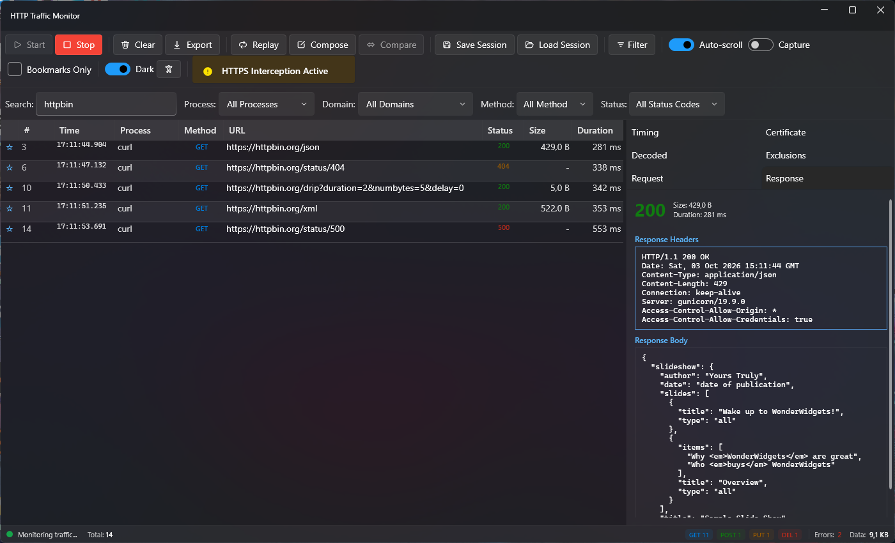

### Filtering
Build multi-condition filters (field / operator / value, AND-ed or OR-ed) and save them as named presets for reuse.

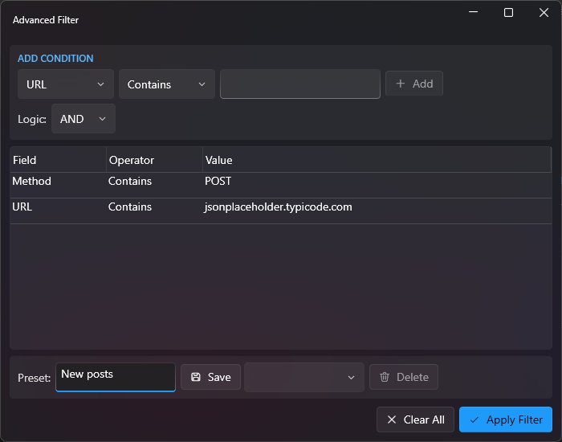

### Replay & compose
Edit and resend any captured request, or compose a brand-new one from scratch, with side-by-side original vs. new response.

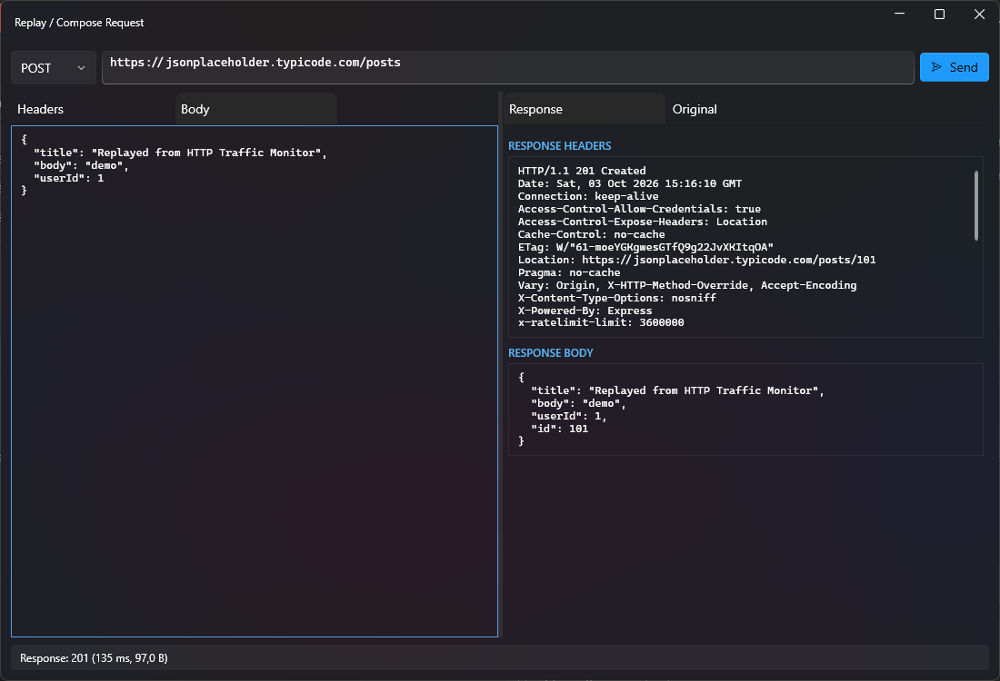

### Compare
Pick two requests and get a line-by-line diff (via [DiffPlex](https://github.com/mmanela/diffplex)) across headers and bodies.

### Alerts
Rule-based alerting on status codes, response time thresholds, or custom patterns, with a live event feed. Below, the built-in **Server Errors (5xx)** rule has caught the demo request to `httpbin.org/status/500`.

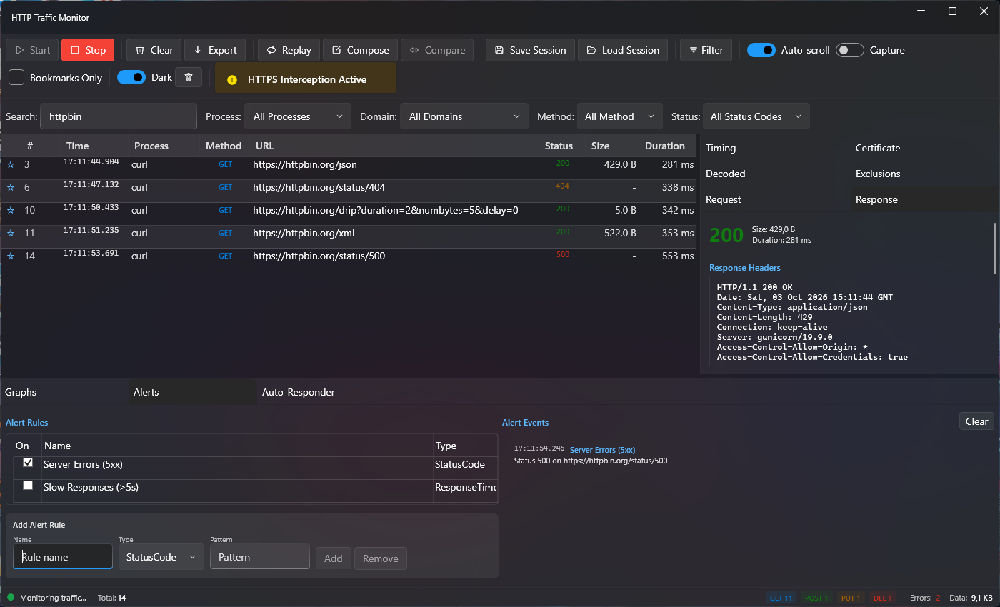

### Auto-Responder (mocking)
Intercept matching requests (by URL/regex + method) and return a canned status code, headers, and body — or serve a file — with an optional artificial delay. Great for mocking flaky or unavailable backends during development.

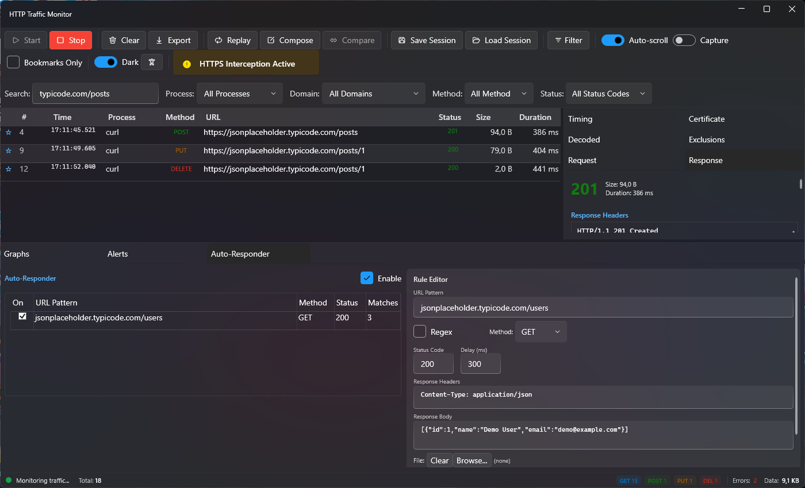

### Graphs
Live requests-per-second and bandwidth charts, plus top-domains and top-processes breakdowns (via [LiveCharts2](https://livecharts.dev/)).

### Sessions & export
Save/load full capture sessions, bookmark interesting requests, and export selections as **CSV**, **HAR**, **JSON**, **cURL**, or **Postman collection**.

### Light & dark themes
Full Fluent Design theming via [WPF-UI](https://github.com/lepoco/wpfui).

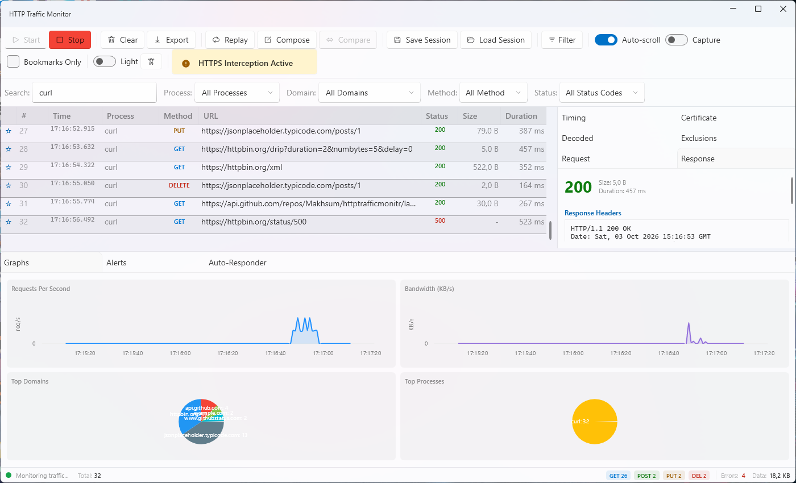

## MCP Server

`HttpTrafficMonitor.McpServer` exposes the running app to AI assistants over the [Model Context Protocol](https://modelcontextprotocol.io) (stdio transport). The main app hosts a small local REST API (`http://localhost:18081/api/...`) via `IpcApiService`; the MCP server is a thin process that talks to that API and surfaces it as MCP tools — so an assistant can start/stop capture, inspect and filter requests, manage alerts and auto-responder rules, replay/compose requests, and export data, all without touching the UI.

Here an assistant answers a question about the captured traffic through the MCP server (the tool replies are from a real session, shortened to the lines that matter):

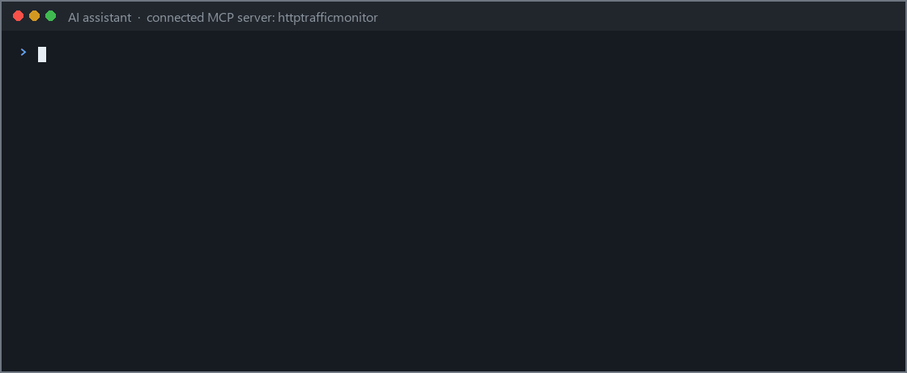

Tool groups (see `HttpTrafficMonitor.McpServer/Tools/`):

| File | Covers |
|---|---|
| `ProxyTools` | Start/stop capture, proxy status, pause/resume |
| `TrafficTools` | List/get requests, domains, traffic stats |
| `FilterTools` | Filter requests, save/load/delete filter presets |
| `AlertTools` | Manage alert rules, read alert events, toggle sound |
| `AutoResponderTools` | Manage mock/auto-responder rules and status |
| `ReplayTools` | Replay a captured request |
| `SessionTools` | Save/load capture sessions |
| `ExportTools` | Export as CSV / HAR / JSON / cURL / Postman |
| `BookmarkTools` | Toggle/list bookmarks |
| `ContentTools` | Encode/decode request or response bodies |
| `StatsTools` | Traffic statistics, TLS info |

Add it to an MCP-capable client (e.g. Claude Code / Claude Desktop) pointing at the built `HttpTrafficMonitor.McpServer.exe`; the main `HttpTrafficMonitor.exe` must already be running and capturing for most tools to return data.

### Configuring the MCP server

Build it first:

```
dotnet build HttpTrafficMonitor.McpServer/HttpTrafficMonitor.McpServer.csproj -c Debug
```

This produces `HttpTrafficMonitor.McpServer/bin/Debug/net8.0/HttpTrafficMonitor.McpServer.exe`. Adjust paths below if you build in `Release` or from a different clone location.

**Claude Code** — the repo ships a project-scoped `.mcp.json` in its root that starts the server with `dotnet run --project HttpTrafficMonitor.McpServer`, so opening the clone in Claude Code is enough (approve the `httptrafficmonitor` server when prompted) — no absolute paths to adjust. To register a built exe instead, use the CLI:

```
claude mcp add httptrafficmonitor -- "C:\Projects\httptrafficmonitr\HttpTrafficMonitor.McpServer\bin\Debug\net8.0\HttpTrafficMonitor.McpServer.exe"
```

which writes (or edit `.mcp.json` directly):

```json
{
  "mcpServers": {
    "httptrafficmonitor": {
      "command": "C:\\Projects\\httptrafficmonitr\\HttpTrafficMonitor.McpServer\\bin\\Debug\\net8.0\\HttpTrafficMonitor.McpServer.exe",
      "args": []
    }
  }
}
```

**Claude Desktop** — add the same block to `claude_desktop_config.json` (`%APPDATA%\Claude\claude_desktop_config.json`):

```json
{
  "mcpServers": {
    "httptrafficmonitor": {
      "command": "C:\\Projects\\httptrafficmonitr\\HttpTrafficMonitor.McpServer\\bin\\Debug\\net8.0\\HttpTrafficMonitor.McpServer.exe",
      "args": []
    }
  }
}
```

**Running via `dotnet` instead of the exe** (e.g. cross-platform host, or you'd rather not hardcode a self-contained exe path) — point `command` at `dotnet` and pass the DLL as the first arg:

```json
{
  "mcpServers": {
    "httptrafficmonitor": {
      "command": "dotnet",
      "args": [
        "C:\\Projects\\httptrafficmonitr\\HttpTrafficMonitor.McpServer\\bin\\Debug\\net8.0\\HttpTrafficMonitor.McpServer.dll"
      ]
    }
  }
}
```

Optional environment variable (only needed if the main app's IPC API isn't on its default port):

```json
{
  "mcpServers": {
    "httptrafficmonitor": {
      "command": "C:\\Projects\\httptrafficmonitr\\HttpTrafficMonitor.McpServer\\bin\\Debug\\net8.0\\HttpTrafficMonitor.McpServer.exe",
      "args": [],
      "env": {
        "HTM_API_URL": "http://localhost:18081"
      }
    }
  }
}
```

After editing the config, restart Claude Code / Claude Desktop, launch `HttpTrafficMonitor.exe` (as Administrator) and click **Start**, then the `httptrafficmonitor` tools become available to the assistant.

## Requirements

- Windows 10/11
- [.NET 8 SDK](https://dotnet.microsoft.com/download) (`net8.0-windows`, WPF)
- **Administrator privileges** — the app requests elevation via its manifest (`app.manifest`, `requireAdministrator`), needed to register itself as the system proxy and install the local root CA

> ⚠️ HTTPS interception installs a root CA into your system trust store and lets the app read HTTPS traffic in plaintext. Use it only for development/debugging on machines you control — the app shows a warning dialog on first launch and restores your original proxy settings when you stop monitoring or close it.

## Build & run

```
dotnet build HttpTrafficMonitor.csproj -c Debug
```

Run `bin/Debug/net8.0-windows/HttpTrafficMonitor.exe` (elevation prompt expected), or open `HttpTrafficMonitor.sln` in Visual Studio and hit F5.

To build the MCP server:

```
dotnet build HttpTrafficMonitor.McpServer/HttpTrafficMonitor.McpServer.csproj
```

## Tech stack

- WPF on .NET 8, [WPF-UI](https://github.com/lepoco/wpfui) for Fluent Design
- [Titanium.Web.Proxy](https://github.com/justcoding121/Titanium-Web-Proxy) for MITM proxying
- [LiveChartsCore (SkiaSharp)](https://livecharts.dev/) for charts
- [DiffPlex](https://github.com/mmanela/diffplex) for the Compare view
- `ModelContextProtocol` .NET SDK for the MCP server

## Project structure

```
Models/          Request/session/alert/auto-responder/TLS data models
Services/        Proxy, alerts, export, replay, session, content decoding, IPC API, theming
ViewModels/      MVVM view models per view/panel
Views/           MainWindow + dialogs (Advanced Filter, Replay/Compose, Comparison)
HttpTrafficMonitor.McpServer/   Standalone MCP server (stdio) bridging to the running app's IPC API
```

## UI automation

Interactive controls across the main window and dialogs carry `AutomationProperties.AutomationId` (e.g. `Toolbar.StartButton`, `FilterBar.SearchTextBox`, `MainWindow.RequestsGrid`, `AdvancedFilter.ApplyFilterButton`, `AutoResponder.AddRuleButton`) so the app can be driven and tested via UI Automation / test tooling without relying on fragile name- or coordinate-based lookups.

## Contributing

Bug reports, feature ideas and pull requests are welcome. [Open an issue](https://github.com/Makhsum/httptrafficmonitr/issues/new/choose) with the bug-report or feature-request form, and read [CONTRIBUTING.md](CONTRIBUTING.md) for how to build and run the app and the MCP server from a fresh clone. Please report security problems privately as described in [SECURITY.md](SECURITY.md), and follow the [Code of Conduct](CODE_OF_CONDUCT.md). Changes are listed in [CHANGELOG.md](CHANGELOG.md).
